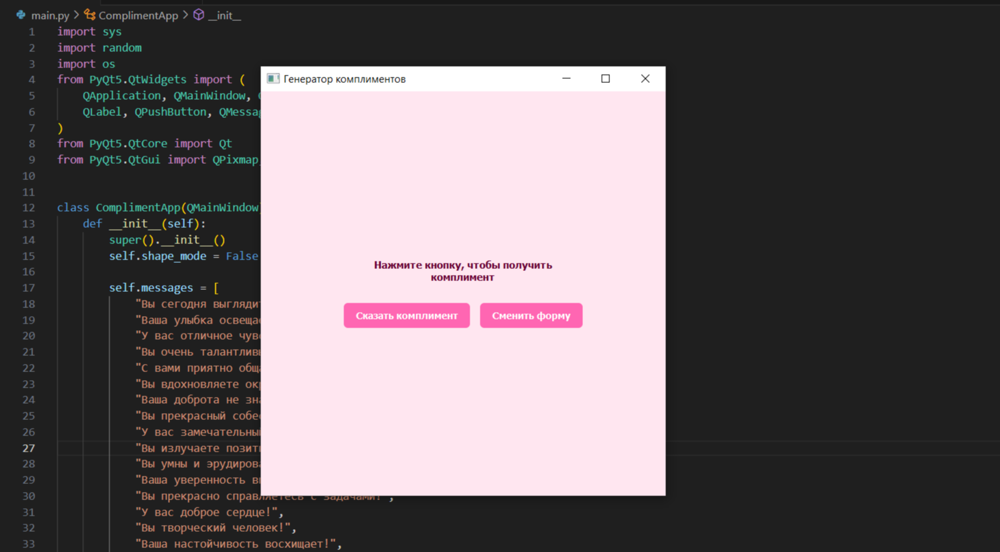
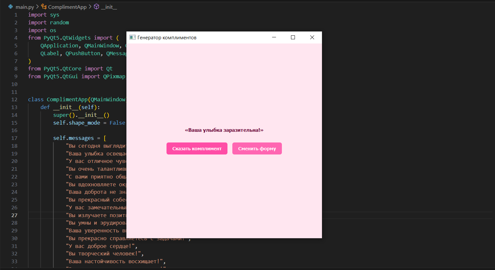
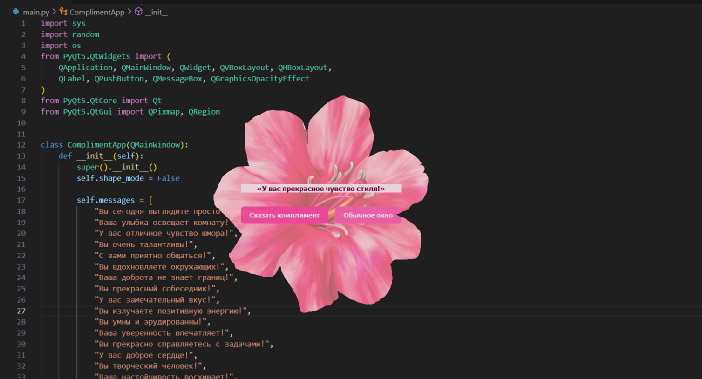
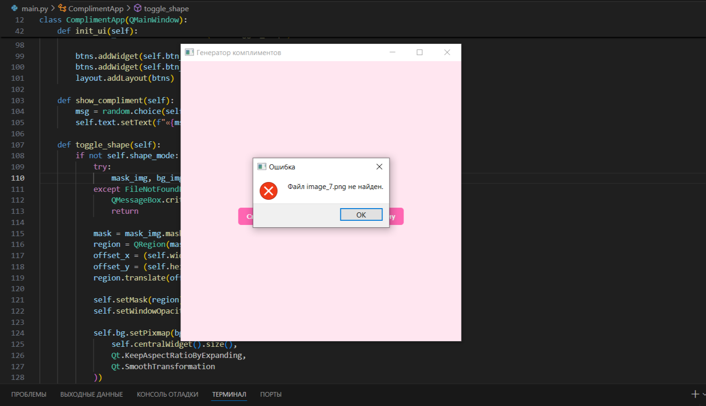
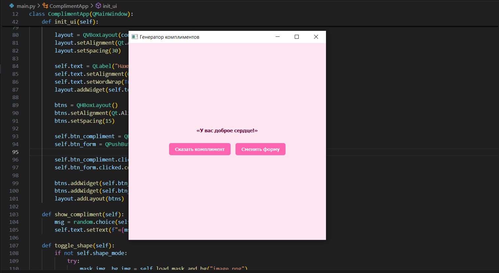

# Лабораторная работа №1: Генератор комплиментов

## Краткое описание
Приложение с графическим интерфейсом (PyQt5), которое случайным образом генерирует комплименты и позволяет менять форму окна с использованием изображения-маски.

## Функционал
- Отображение приветственного текста.
- Кнопка для генерации случайного комплимента.
- Кнопка для смены формы окна (с использованием PNG-файла `image.png`).
- Возможность вернуться к обычному виду окна.

## Требования
- Python 3.8+
- Библиотека PyQt5

Установка зависимостей:
```bash
pip install PyQt5
```

## Пример работы

1. При запуске отображается окно с розовым дизайном и кнопками.
   

2. Нажатие кнопки **«Сказать комплимент»** выводит случайный комплимент.
   

3. Нажатие кнопки **«Сменить форму»** меняет форму окна (если найден файл `image.png`).
   

⚠️ Если файл `image.png` не найден или повреждён, появится окно с ошибкой, а форма окна останется обычной.
   

4. Кнопка **«Обычное окно»** возвращает исходный вид.
   

