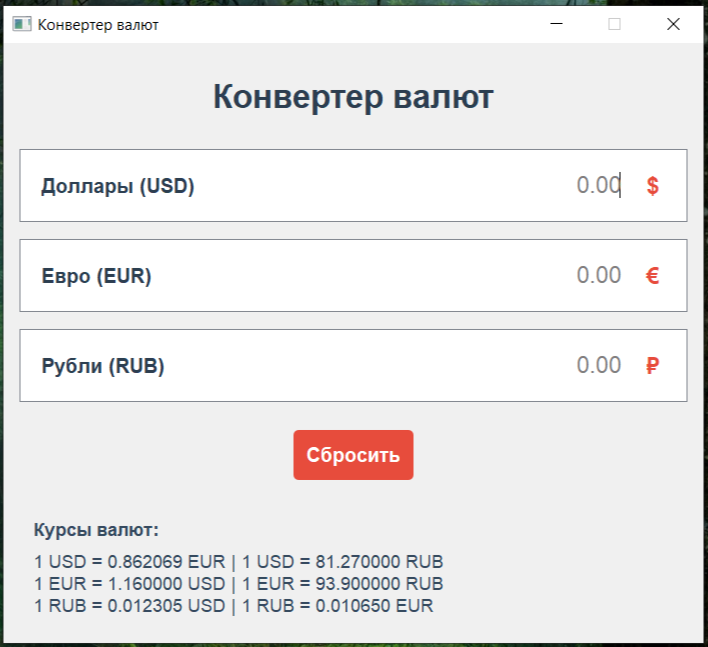
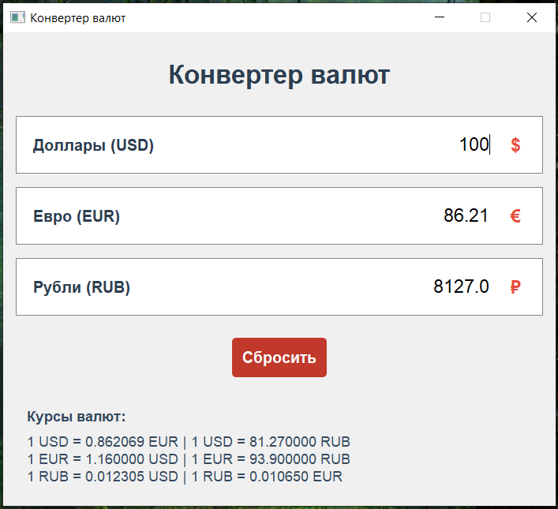
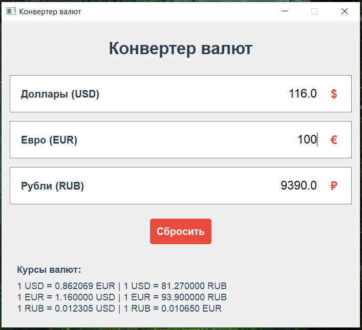
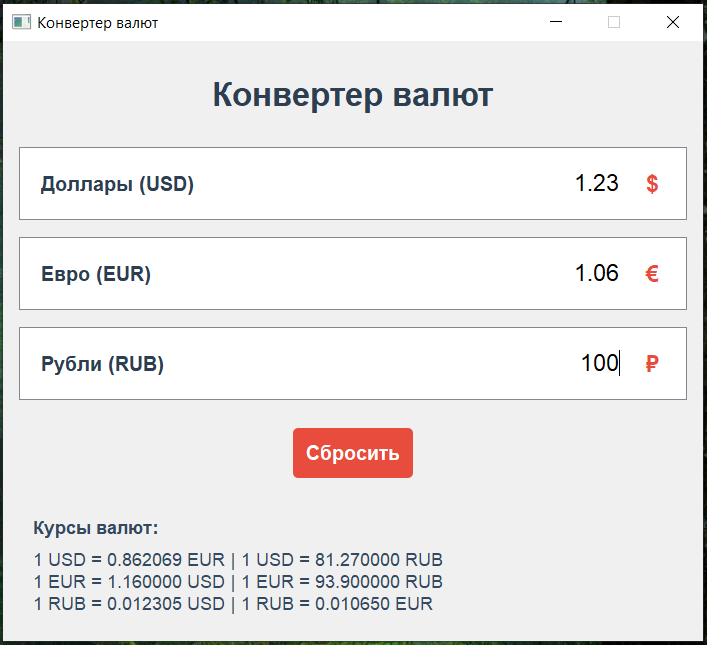
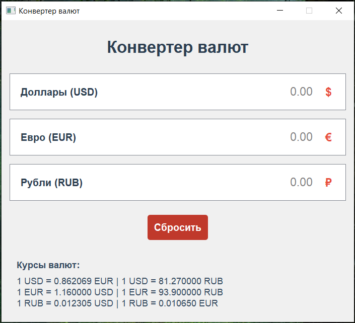

# Лабораторная работа №2: Конвертер валют

## Краткое описание
Приложение с графическим интерфейсом (PyQt5) для конвертации валют между долларами (USD), евро (EUR) и рублями (RUB) в реальном времени.

## Функционал
- Три поля ввода для конвертации валют: USD, EUR, RUB.
- Автоматический пересчет значений при вводе в любое поле.
- Отображение актуальных курсов валют.
- Кнопка сброса для очистки всех полей.
- Использование сигналов и событий PyQt5 для связи между полями ввода.

## Требования
- Python 3.8+
- Библиотека PyQt5

Установка зависимостей:
```bash
pip install PyQt5
```

## Пример работы

### 1. Главное окно приложения
При запуске отображается окно с тремя полями для ввода валют и курсы валют.


### 2. Конвертация из долларов
При вводе значения в поле "Доллары (USD)" автоматически рассчитываются эквиваленты в евро и рублях.


### 3. Конвертация из евро  
При вводе значения в поле "Евро (EUR)" автоматически рассчитываются эквиваленты в долларах и рублях.


### 4. Конвертация из рублей
При вводе значения в поле "Рубли (RUB)" автоматически рассчитываются эквиваленты в долларах и евро.


### 5. Сброс полей ввода
Нажатие кнопки "Сбросить" очищает все поля ввода.
