# Лабораторная работа №3: Приложение для работы с базами данных

## Краткое описание
Приложение с графическим интерфейсом (PyQt5) для работы с базой данных SQLite, содержащей информацию о товарах магазина. Приложение предоставляет различные способы просмотра и анализа данных из таблицы `shop`.

## Функционал
- **Управление соединением**: Установка и закрытие соединения с базой данных
- **Просмотр данных**: Различные способы отображения информации о товарах
- **Фильтрация**: Фильтр товаров по диапазону цен
- **Аналитика**: Статистические отчеты по категориям, поставщикам и ценовым диапазонам
- **Интерактивность**: Взаимодействие с данными через вкладки и элементы управления

## Требования
- Python 3.8+
- Библиотека PyQt5
- База данных SQLite с таблицей `shop`

Установка зависимостей:
```bash
pip install PyQt5
```
## Пример работы

### 1. Главное окно приложения
При запуске отображается окно с элементами управления и пятью вкладками. Все кнопки, кроме "Установить соединение с БД", initially отключены.

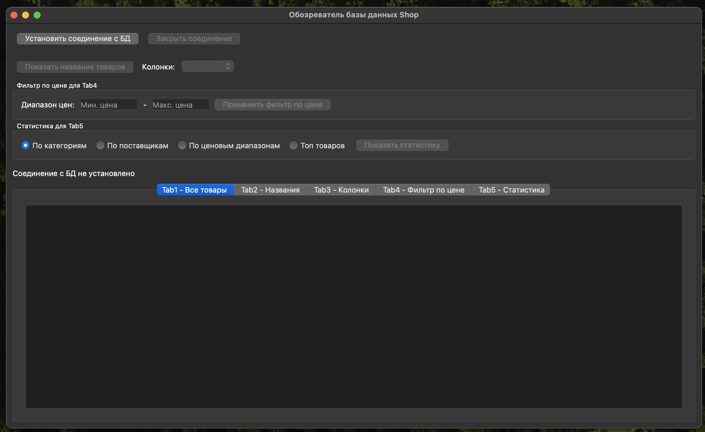

### 2. Установка соединения с БД
При нажатии кнопки "Установить соединение с БД" открывается диалог выбора файла базы данных. После выбора файла SQLite:
- Активируются все элементы управления
- В Tab1 автоматически загружаются все товары из таблицы shop
- Заполняется выпадающий список доступных колонок
- Отображается статус подключения

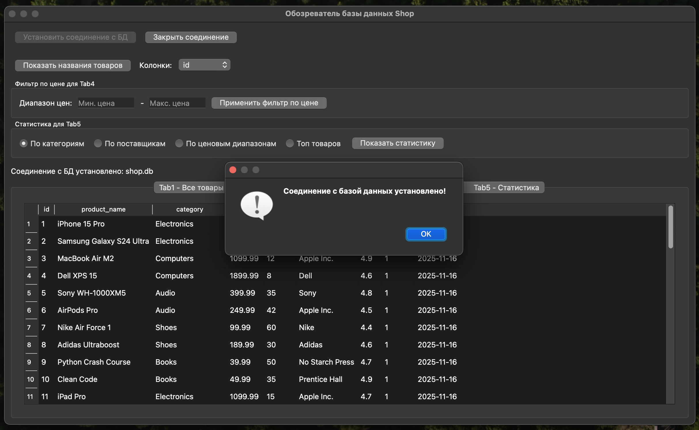

### 3. Просмотр всех товаров (Tab1)
Во вкладке "Tab1 - Все товары" отображается полная информация о всех товарах из таблицы shop с автоматическим определением колонок и подгонкой размеров.

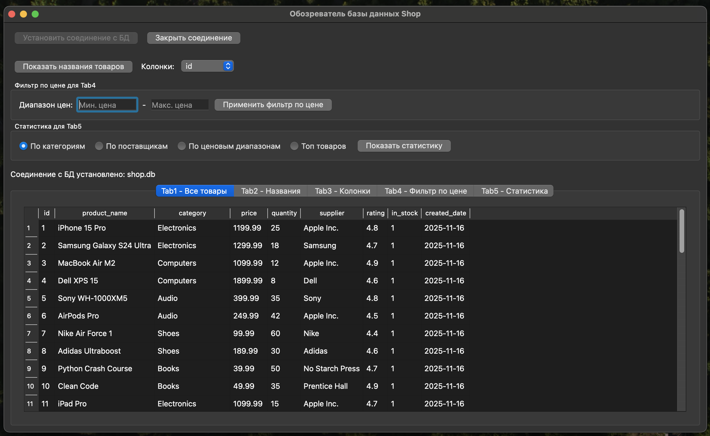

### 4. Просмотр названий товаров (Tab2)
При нажатии кнопки "Показать названия товаров" во вкладке "Tab2 - Названия" отображается список только названий товаров.

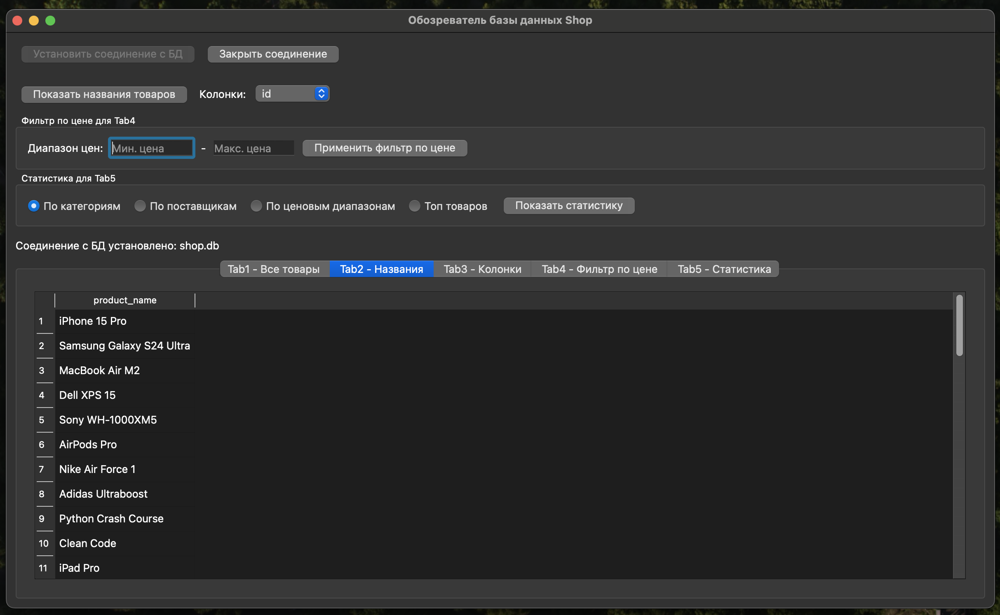

### 5. Анализ отдельных колонок (Tab3)
При выборе колонки в выпадающем списке "Колонки" во вкладке "Tab3 - Колонки" автоматически отображаются данные только выбранной колонки (например, цены, категории или рейтинги).

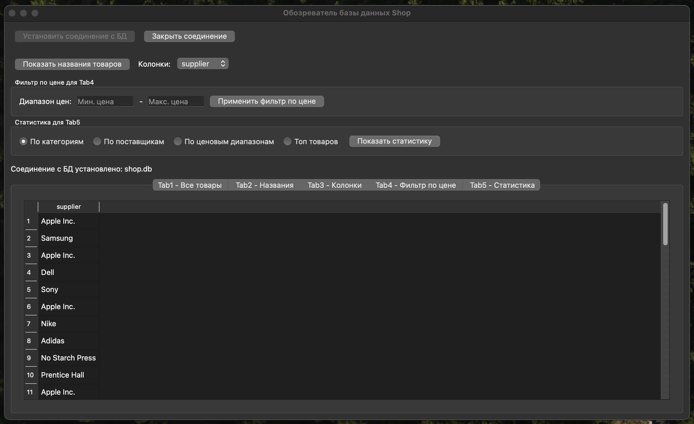

### 6. Фильтрация по цене (Tab4)
Во вкладке "Tab4 - Фильтр по цене":
- Ввод минимальной цены и максимальной
- Нажатие кнопки "Применить фильтр по цене"
- Отображение товаров в ценовом диапазоне, отсортированных по цене

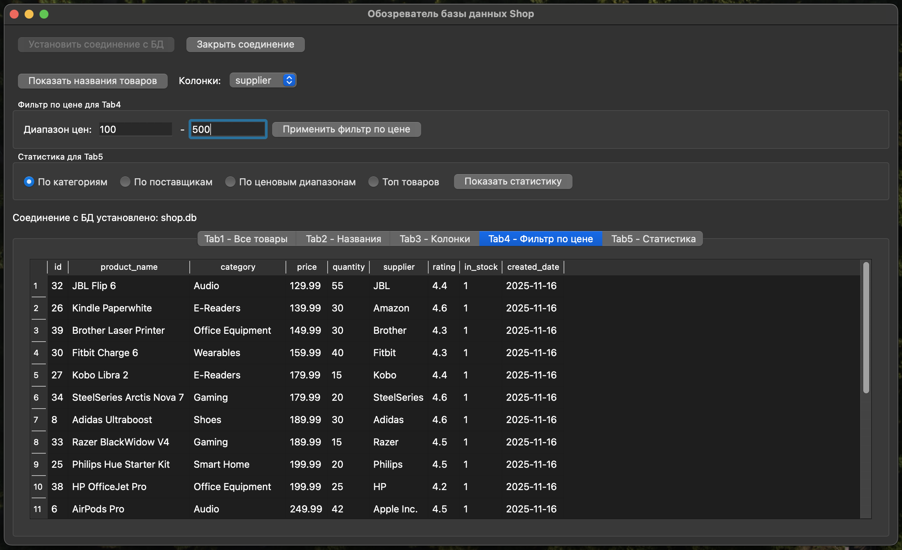

### 7. Статистические отчеты (Tab5)
Во вкладке "Tab5 - Статистика" доступны четыре типа отчетов:

- **По категориям:** группировка товаров по категориям с подсчетом количества, средней цены, максимальной/минимальной цены и общего количества.

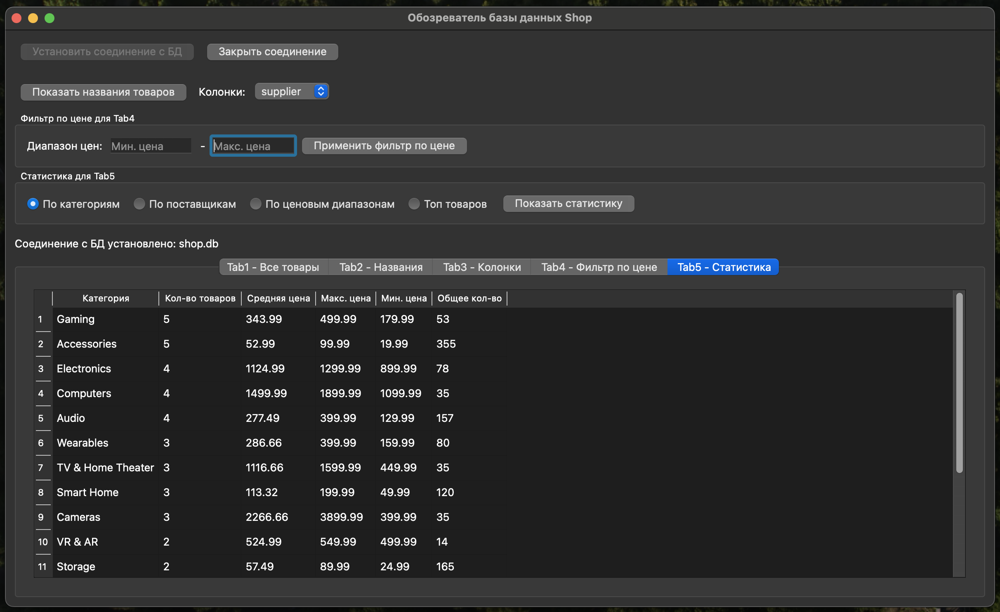

- **По поставщикам:** анализ поставщиков с информацией о количестве товаров, средней цене и общей стоимости товаров.

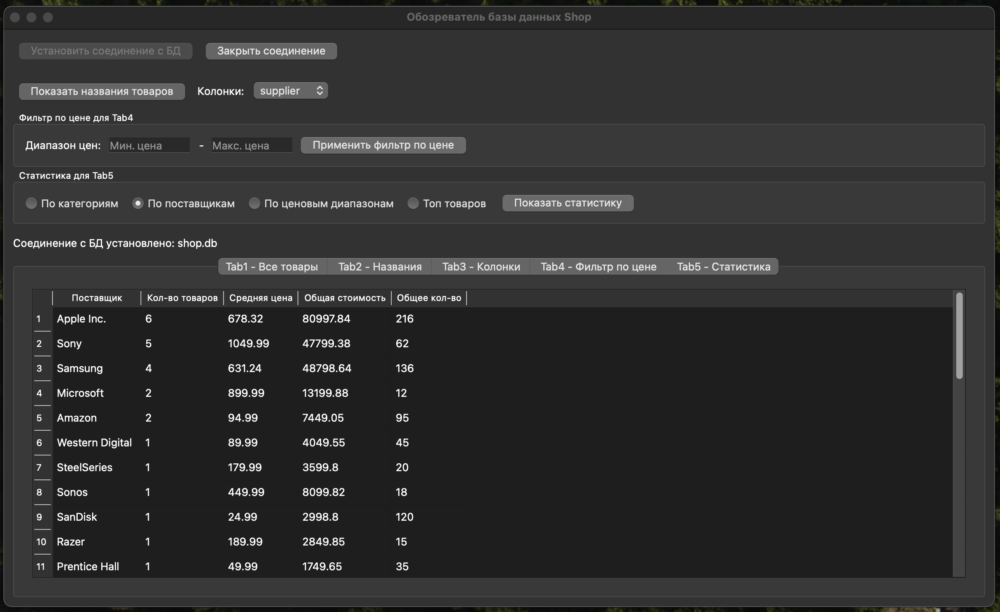

- **По ценовым диапазонам:** группировка товаров по ценовым категориям (до 100, 100-500, 500-1000, 1000-2000, выше 2000).

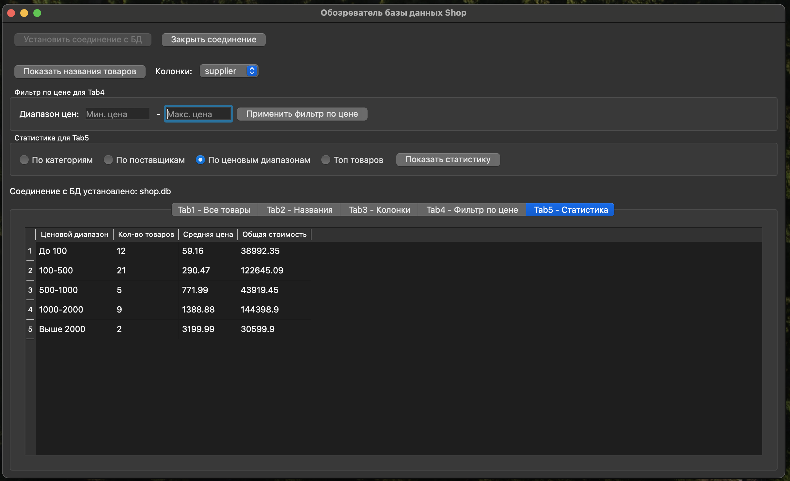

- **Топ товаров:** 15 лучших товаров, отсортированных по рейтингу и цене.

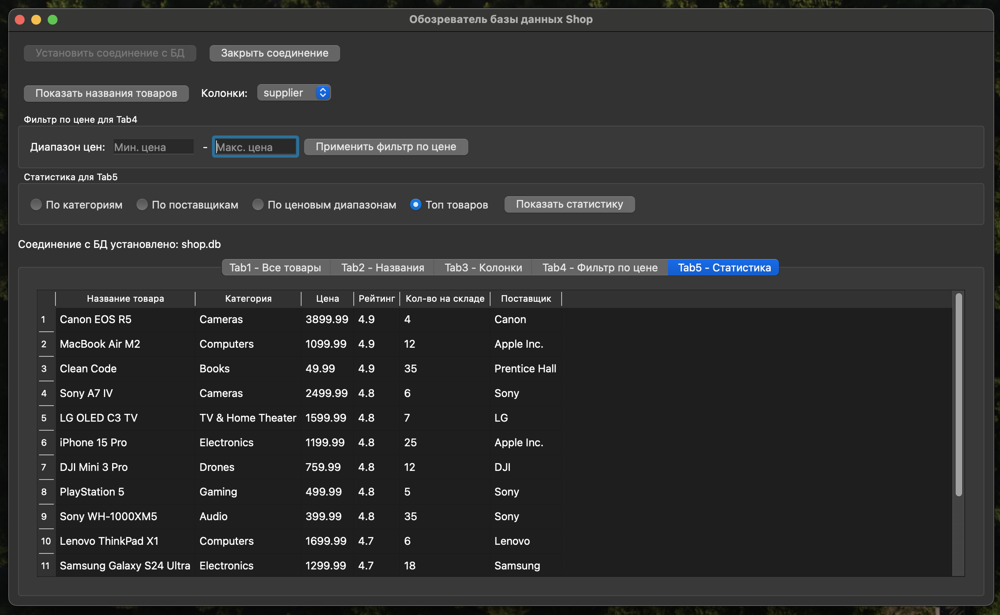

### 8. Закрытие соединения
При нажатии кнопки "Закрыть соединение": 
- Разрывается соединение с базой данных
- Очищаются все таблицы и поля ввода
- Отключаются элементы управления
- Отображается статус отключения

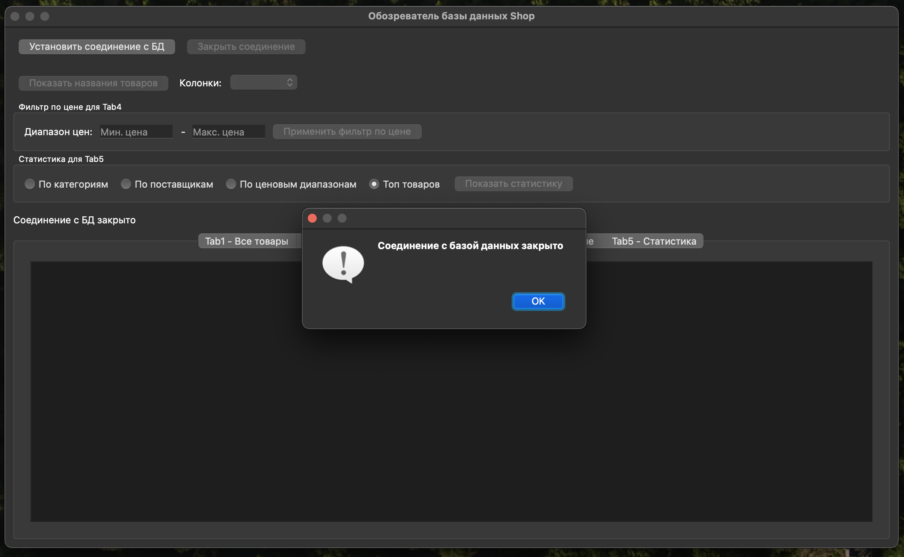