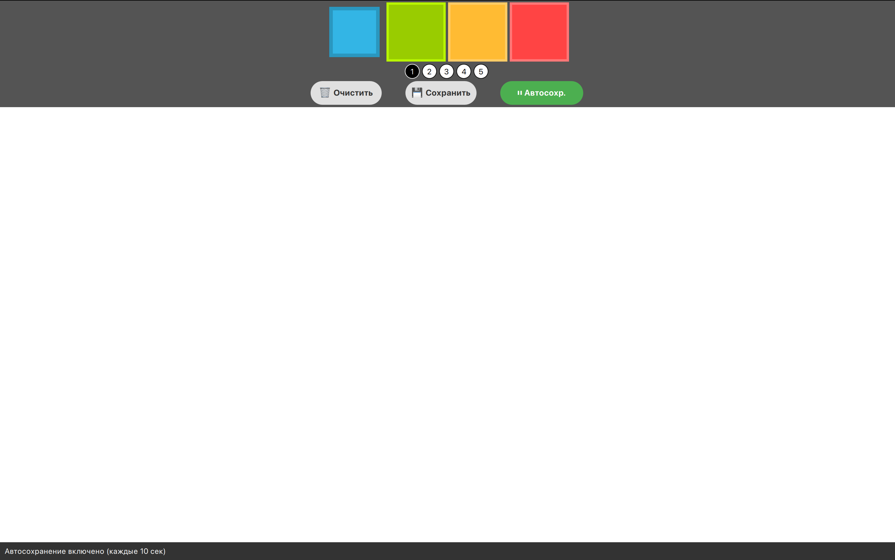
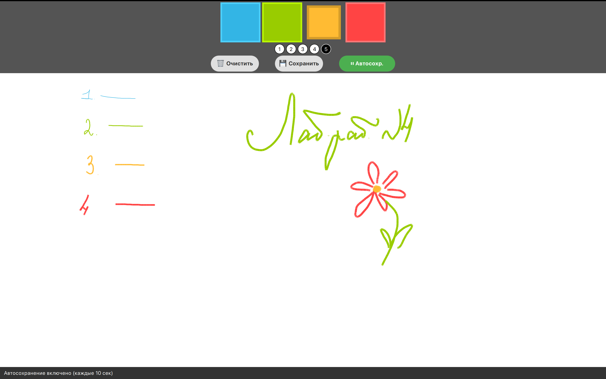
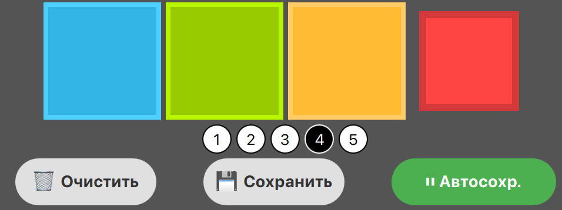
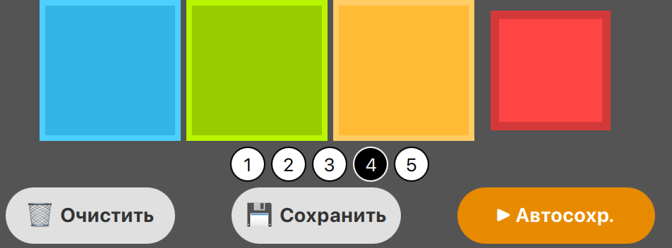
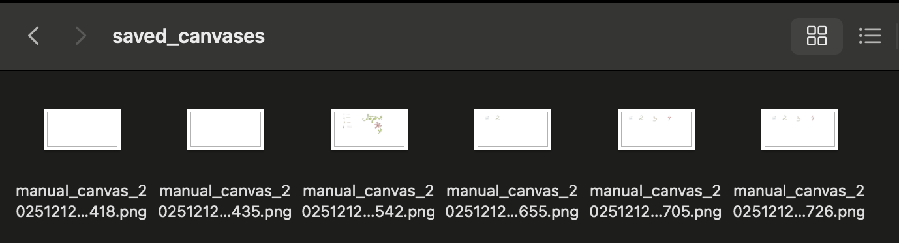

# Лабораторная работа №4: Графическое приложение "Paint" с автосохранением

## Краткое описание
Приложение для рисования с графическим интерфейсом на QML/PyQt5. Приложение позволяет рисовать на холсте, выбирать цвета и толщину линий, а также автоматически сохранять работу по таймеру.

## Функционал
- **Рисование**: Свободное рисование на холсте с помощью мыши
- **Инструменты**: Выбор цвета и толщины линии
- **Управление**: Очистка холста, ручное и автоматическое сохранение
- **Автосохранение**: Автоматическое сохранение рисунка через заданные интервалы времени
- **Экспорт**: Сохранение рисунков в формате PNG

## Требования
- Python 3.8+
- Библиотека PyQt5
- Qt5/Qt6 для QML

Установка зависимостей:
```bash
pip install PyQt5
```
## Пример работы

### 1. Главное окно приложения
При запуске отображается окно с инструментами рисования и холстом. В верхней части доступны:
- **Палитра цветов**: 4 цвета для рисования (#33B5E5, #99CC00, #FFBB33, #FF4444)
- **Толщина линии**: 5 вариантов толщины (1-5 пикселей)
- **Кнопки управления**: Очистка, сохранение, управление автосохранением




### 2. Процесс рисования
- **Рисование**: Зажатие левой кнопки мыши и движение по холсту
- **Реализация**: Линии рисуются в реальном времени с выбранными параметрами
- **Очистка**: Кнопка "🗑 Очистить" полностью очищает холст



### 3. Сохранение рисунков
- **Ручное сохранение** - при нажатии кнопки "💾 Сохранить"
- **Автоматическое сохранение** - каждые 10 секунд
- Изображение конвертируется в формат PNG
- Сохраняется в папку `saved_canvases`
- Имя файла: `manual_canvas_YYYYMMDD_HHMMSS.png`

### 4. Управление автосохранением
- **Включено**: Кнопка показывает "⏸ Автосохр." (зеленый цвет)
- **Выключено**: Кнопка показывает "▶ Автосохр." (оранжевый цвет)
- **Статус**: В нижней строке отображается состояние автосохранения




### 5. Сохраненные файлы
Все сохраненные рисунки хранятся в папке `saved_canvases`:

